# Final_PJT_SSAFY(11.25종료 / ~추가 업데이트 진행 중)

### 1. 기능 구현 🖋

- TMDB 데이터 추출 및 가공 및 DB 저장
- 영화 알고리즘 구현(총 4가지-팔로우기반, 유저 기록 기반, 모든 유저의 최근 기록 기반,현재 상영작)
- 장르별 영화 출력
- 검색창 및 기능 구현 - 🛠**추가 업데이트( 12.03 )**
- 리뷰, 댓글 생성/수정/삭제/조회 구현(CRUD)
- 감독, 배우별 정보 이동 링크 생성
- 별점 평균 계산 작업
- 영화 세부 정보, 전체 리스트 CSS 작업
- 프로필 이미지 생성/수정/삭제(삭제 시 기존 이미지도 삭제) - 🛠**추가 업데이트( 11.29 )**
- 카카오맵 구현(전국 영화관 정보 제공) - 🛠**추가 업데이트( 12.01 )**
- 관련 스트리밍 정보제공(예: Neflix, Watch 제공 영화 등) - 🛠**추가 업데이트( 11. 27 )**
- 인피니티 스크롤 - 🛠**추가 업데이트( 12.05 )**

<span style="color:red;">**※ 추가 업데이트 사항의 자세한 내역은 업데이트 사항 폴더에서 확인 가능합니다.**</span>

### 2. 목표 서비스 구현 및 실제 구현 정도 🔎

- 목표 설정

| 목표 서비스 구현                                      | 실제 구현 정도            |
| ----------------------------------------------------- | ------------------------- |
| 회원가입/탈퇴                                         | 완료(박준수)              |
| 로그인/로그아웃                                       | 완료(박준수)              |
| 비밀번호 변경                                         | 완료(박준수)              |
| 영화 정보                                             | 완료                      |
| 영화 리뷰                                             | 완료                      |
| 리뷰 댓글                                             | 완료                      |
| 영화 좋아요                                           | 완료                      |
| 리뷰 좋아요                                           | 완료                      |
| 유저 팔로우                                           | 완료                      |
| 댓글 온오프 기능                                      | 완료                      |
| (알고리즘 추천) 유튜브api활용 유튜버 추천             | 서비스 쪽이므로 삭제 진행 |
| (알고리즘 추천) 장르별, 배우별, 감독별 추천           | 완료                      |
| (알고리즘 추천) 팔로우 기반 추천                      | 완료                      |
| (알고리즘 추천) 사용자 분석 추천                      | 완료                      |
| ↓↓↓↓↓↓↓↓↓↓↓↓추가 기능 구현↓↓↓↓↓↓↓↓↓↓↓↓                |                           |
| + 인피니트 스크롤                                     | 완료(박준수)              |
| + 페이지네이션                                        | 완료(박준수)              |
| + 프로필 이미지 구현(생성, 수정, 삭제)                | 완료                      |
| + 검색창                                              | 완료                      |
| + Netflix와 유사한 hover 기능                         | 완료                      |
| + 이미지 클릭 시 고화질 이미지 보기 창으로 연결       | 완료                      |
| + 팔로우 아이디 클릭 시 해당 유저 프로필로 가기       | 완료                      |
| + 회원탈퇴 시 동일한 문구 입력해야 탈퇴되는 기능 구현 | 완료                      |
| + 카카오맵 구현                                       | 완료                      |

### 3. 데이터베이스 모델링 (ERD) ⚙


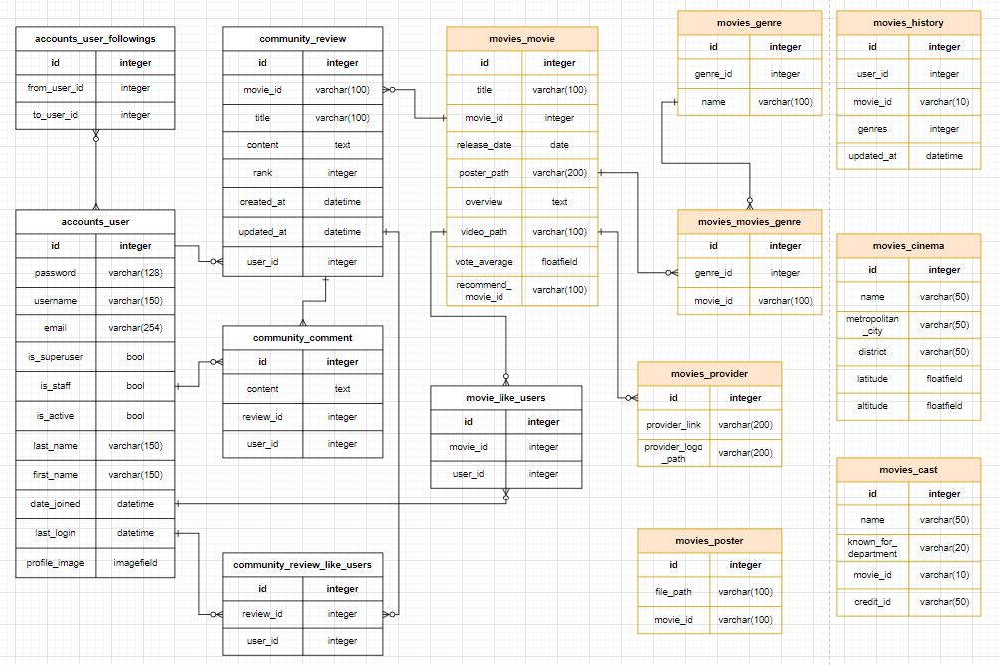


### 4. 영화 추천 알고리즘에 대한 기술적 설명 📢

1. 당신을 위한 영화
   - 영화 상세 보기를 누르거나 좋아요 버튼을 누르면 해당 행동이 기록된다.
     - History 테이블에 유저 정보, 영화 정보, 장르 정보, 클릭 시간이 저장
   - 로그인한 유저의 최근 100회의 행동을 불러와서 어떤 장르를 많이 보았는지 계산을 진행한다.
     - 딕셔너리 형태로 각각의 장르에 대해 카운팅 진행
   - 가장 많이 조회한 최상위 장르 2개를 선정한다.
   - 그 후 해당 장르에 한정하여 총 3가지의 추천 기능이 실행된다
     - 랜덤적으로 각각은 3/1의 확률이다.
     - 1. 해당 장르의 평점 순으로 10개 뽑아서 보여주기
       2. 해당 장르의 모든 영화 중 랜덤으로 10개 뽑아서 보여주기
       3. 해당 장르의 최신 영화(1년 내) 중 10개를 랜덤으로 뽑아서 보여주기

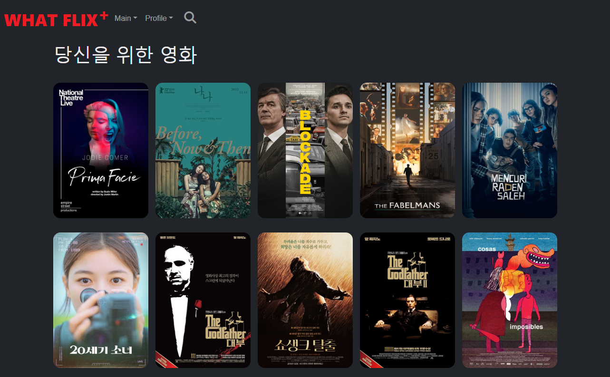

```python
@api_view(['GET'])
def movie_recommend(request):
    '''
    [알고리즘 추천]
    
    로그인한 유저를 대상으로 추천 영화를 제공
    해당 유저의 최근 100회의 활동 기록(History Table)을 통해 가장 선호받은 장르 2개를 선정한다.
    
    고정적이지 않고 동적인 영화 추천을 제공하기 위해 3/1의 확률로 3가지의 추천을 제공한다.(장르 2개 한정)
    1. 단순히 평점순을 나열하여 10개의 데이터를 제공
    
    2. 해당 장르에 대해 랜덤으로 10개 추출하여 제공
    
    3. 최신 영화(31일 이내)의 영화를 10개 랜덤 추출하여 제공
    
    '''
    user = request.user
    actions = History.objects.all().filter(user_id=user.id)
    length = actions.count()
    if length == 0:
        return Response(status=status.HTTP_204_NO_CONTENT)
    if length > 100:
        actions = actions[length-100:]

    genre = {}
    dict1 = actions.values()
    for movie in dict1:
        gen = movie['genres']
        if gen in genre:
            genre[gen] += 1
        else:
            genre[gen] = 1
    li = []
    for i in genre.items():
        li.append(i)
    li.sort(key=lambda x : x[1], reverse=True)
    
    
    if len(li) == 1:
        num = list(range(1, 4))
        getNum = random.sample(num, 1)[0]
        if getNum == 1:     # 평점순 랜덤
            queryset = Movie.objects.filter(genres=li[0][0]).order_by('-vote_average').distinct()[:10]
        elif getNum == 2:   # 올 랜덤
            queryset = Movie.objects.filter(genres=li[0][0]).order_by('?')[:10]
        else:               # 최신영화 중에서 랜덤
            queryset = Movie.objects.filter(genres=li[0][0]).filter(release_date__range=[date.today() - timedelta(days=31), date.today()]).order_by('?')[:10]

    else:
        num = list(range(1, 4))
        getNum = random.sample(num, 1)[0]
        if getNum == 1:     # 평점순 랜덤
            queryset = Movie.objects.filter(genres__in=[li[0][0], li[1][0]]).order_by('-vote_average').distinct()[:10]
        elif getNum == 2:   # 올 랜덤
            movies = Movie.objects.filter(genres__in=[li[0][0], li[1][0]]).values('movie_id').order_by('-vote_average').distinct()
            random_movies = Movie.objects.filter(movie_id__in=movies)
            queryset = random.sample(list(random_movies), 10)
        else:               # 최신영화 중에서 랜덤
            movies = Movie.objects.filter(release_date__range=[date.today() - timedelta(days=365), date.today()]).filter(genres__in=[li[0][0], li[1][0]]).values('movie_id').order_by('-vote_average').distinct()
            random_movies = Movie.objects.filter(movie_id__in=movies)
            queryset = random.sample(list(random_movies), 10)
    serializer = MovieSerializer(queryset, many=True)
    return Response(serializer.data, status=status.HTTP_201_CREATED)

```

2. 팔로우의 추천

- 내가 팔로우한 사람들을 조회한다.
- 해당 파로우들이 좋아요를 누른 영화들을 수집한다
- 그 영화들 중에서 내가 좋아요를 누른 영화는 제외하는 필터링을 진행한다.
- 그렇게 최종 걸러진 영화들을 랜덤으로 10개 택하여 보여준다.

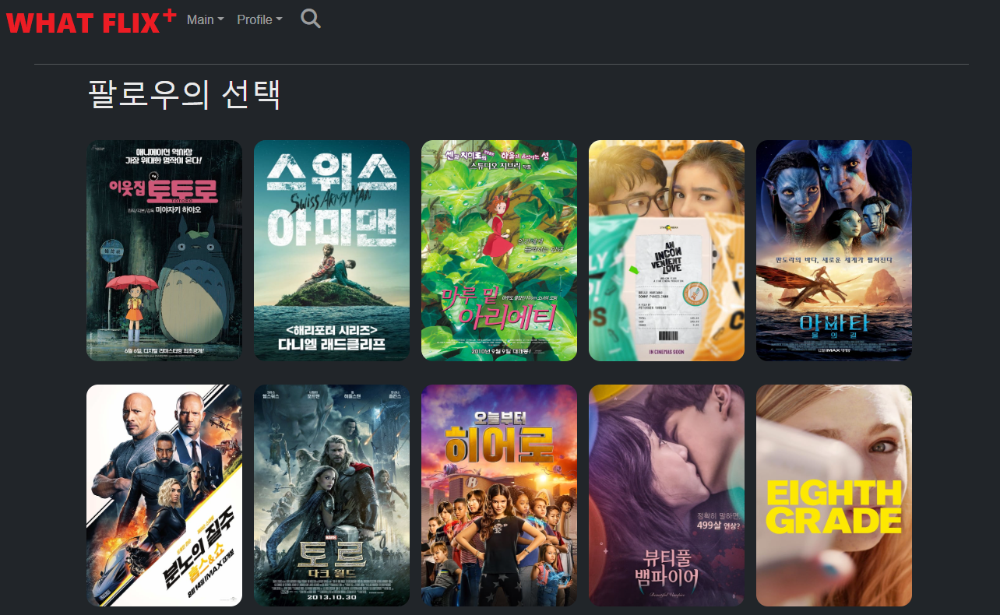

```python
@api_view(['GET'])
def movie_follow_like(request, user_id):
    '''
    [알고리즘 추천]
    
    로그인한 유저가 팔로우한 유저들을 대상으로 영화를 추천해준다.
    팔로우한 유저들이 좋아요를 누른 영화를 파악하여 해당 영화들 중에서 10개를 랜덤으로 제공
    [목적]: 단순히 많은 관심을 받은 영화를 추천하는 게 아니라 동적인 효과를 위해 랜덤을 선택!!
    '''
    User = get_user_model()
    user = User.objects.get(id=user_id) # 나의 정보
    my_like_movies = user.like_movies.all()
    following_people = user.followings.all()
    li = []

    # 내가 팔로우 한 사람들이 좋아하는 영화들의 집합
    for following in following_people:
        movies = following.like_movies.all()
        # print(movies)
        for movie in movies:
            if movie not in li:
                li.append(movie)
    # print(li)
    result = []
    for i in li:
        if i not in my_like_movies:
            result.append(i)
    if len(result) > 10:
        new_result = random.sample(result, 10)
    else:
        new_result = random.sample(result, len(result))

    serializer = MovieSerializer(new_result, many=True)
    # print(serializer.data)
    return Response(serializer.data)
```

3. 왓플릭스 HOT 무비

- 전체 유저에 대한 최근 7일치의 기록을 모두 조회한다.
- 가장 많은 조회/좋아요를 받은 영화들을 순서대로 10개 추출하여 보여준다.
  - 최근 가장 관심을 받고 있는 영화를 유동적으로 보여줄 수 있다.

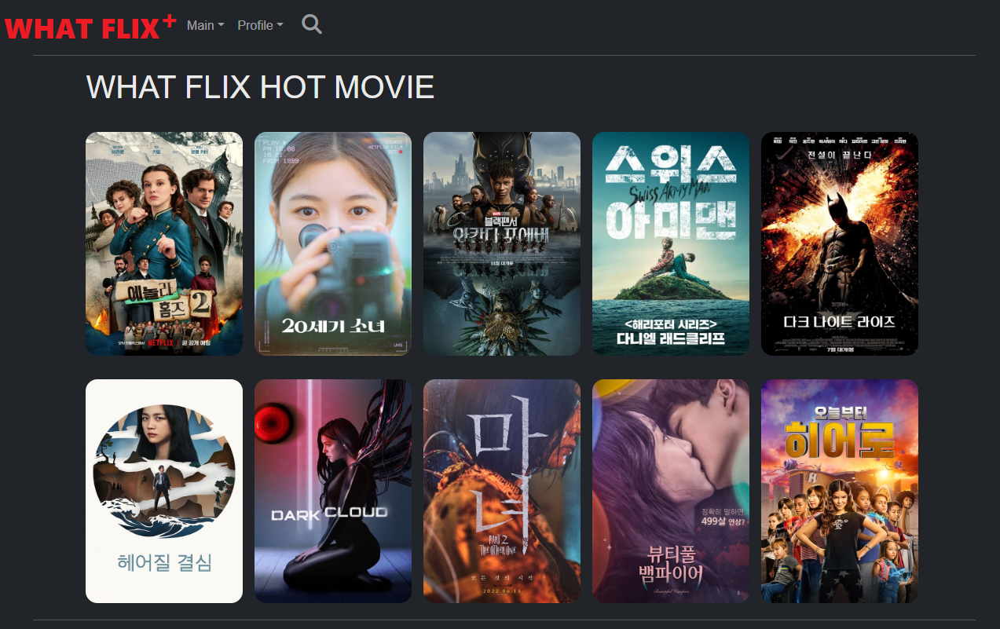

```python
@api_view(['GET'])
def movie_trend(request):
    '''
    모든 유저들의 History 기록을 탐색해서 일주일 동안 가장 많은 조회수와 좋아요를 얻은 영화를 10개 출력
    [어려운 점]: QuerySet의 활용과 정보 가공이 까다로웠다.
    '''
    movie_dict = {}
    trends = History.objects.filter(updated_at__gte = timezone.now() - timedelta(days=7))
    for trend in trends:
        movie = trend.movie_id
        if movie in movie_dict:
            movie_dict[movie] += 1
        else:
            movie_dict[movie] = 1

    li = []
    for j in movie_dict.items():
        li.append(j)
    li.sort(key=lambda x: x[1], reverse=True)
    total_li = []
    cnt = 0
    for k in li:
        trend_movie = Movie.objects.get(movie_id=k[0])
        total_li.append(trend_movie)
        cnt += 1
        if cnt == 10:
            break
    serializer = MovieListSerializer(total_li, many=True)
    return Response(serializer.data)
```

4. 현재 상영작

- TMDB API로 받아온 영화 정보를 시간순으로 정렬한다.
- 최근 한 달 내에 개봉한 영화들을 나열하여 보여준다.

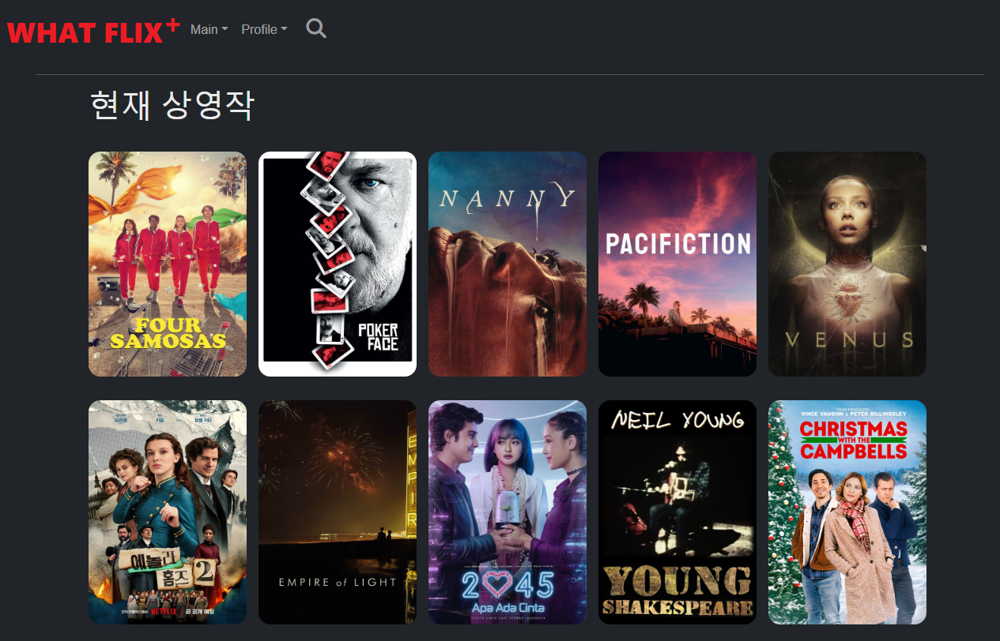

```python
@api_view(['GET'])
def movie_upcoming(request):
    '''
    최근 30일의 영화를 뽑아와서 현재 상영작으로 출력
    '''
    movies = Movie.objects.all().filter(release_date__range=[date.today() - timedelta(days=30), date.today()])
    if len(movies) >= 10:
        movies = random.sample(list(movies), 10)
    serializer = MovieListSerializer(movies, many=True)
    return Response(serializer.data)
```


5. 관련 영화 추천

- 영화 상세 보기에 들어갔을 때 TMDB에서 제공하는 관련 추천 영화 정보가 있으면 해당 정보를 보여준다
- 만약 TMDB에 관련 영화 추천 정보가 없을 경우 영화 장르와 동일한 영화를 랜덤으로 6개 보여준다.

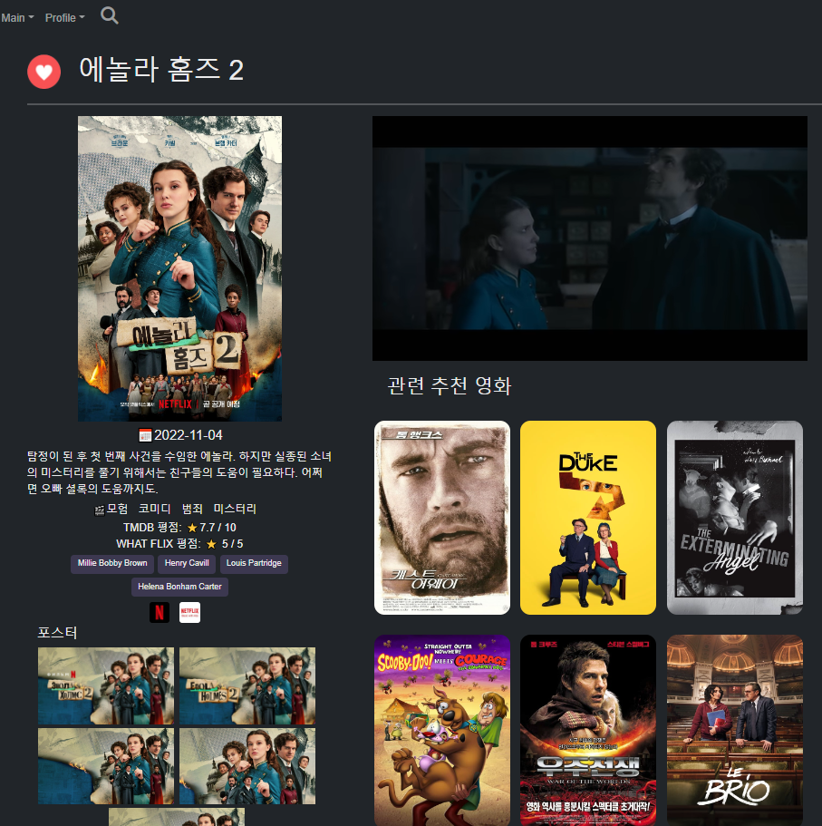

```python
@api_view(['GET'])
def movie_related(request, movie_id):
    '''
    관련 영화 추천: TMDB에서 제공하는 관련 추천 영화가 있으면 해당 영화의 6개를 추천, 
    없을 경우 비슷한 장르 2개의 랜덤한 영화 6개 보여주기
    '''
    movie = Movie.objects.get(movie_id=movie_id)
    li = movie.genres.all()
    movies = Movie.objects.filter(recommend_movie_id=movie_id).order_by('?')[:6]
    if not(movies):
        if len(li) == 1:
            queryset = Movie.objects.filter(genres__in=[li[0]]).exclude(movie_id__in=[movie_id])
            movies = queryset.order_by('?')[:6]
        else:
            queryset = Movie.objects.filter(genres__in=[li[0],li[1]]).exclude(movie_id__in=[movie_id]).order_by('id').distinct()
            movies = set()
            for movie in queryset:
                if movie not in movies:
                    movies.add(movie)
            movies = random.sample(list(movies), 6)
    serializer = MovieSerializer(movies, many=True)
    # print(serializer)
    return Response(serializer.data)
```


### 5. 서비스 대표 기능에 대한 설명

- 메인 페이지
  - 알고리즘 추천 영화와 전체 영화가 나열되어있다.
    - 인피니트 스크롤링이 적용되어 있어 스크롤이 다 내려가면 다시 영화 정보를 불러 온다.
  - navbar에 기본적으로 로그인, 로그아웃, 프로필, 회원 정보 수정, 장르별, 무비별 탭을 갖추고 있다.

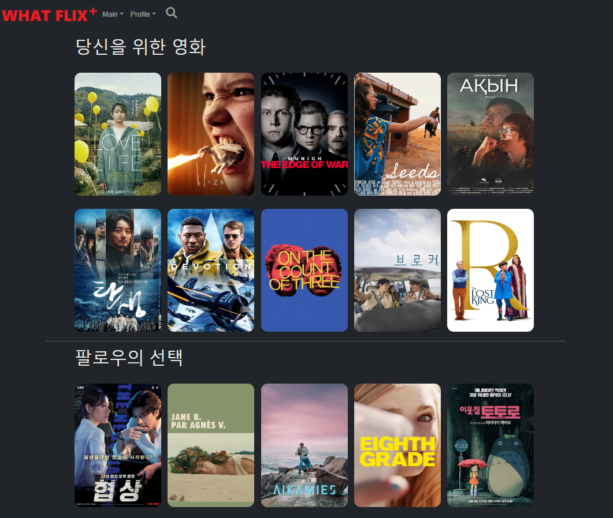

- 영화 상세 정보
  - 영화에 대한 기본적인 정보 제공
    - 유튜브 예고편 링크, 개봉일, 줄거리, TMDB평점/WHATFLIX 유저 평점, 배우/감독 정보(링크 이동 가능), 스트리밍 제공사 정보 제공(링크 제공), 고화질 포스터(5개 제공), 관련 추천 영화(6개)
  - 리뷰 작성 및 댓글 작성
    - 하단에 영화에 대한 별점 리뷰를 작성할 수 있다.
    - 리뷰에 대한 댓글 작성 기능도 구현 완료


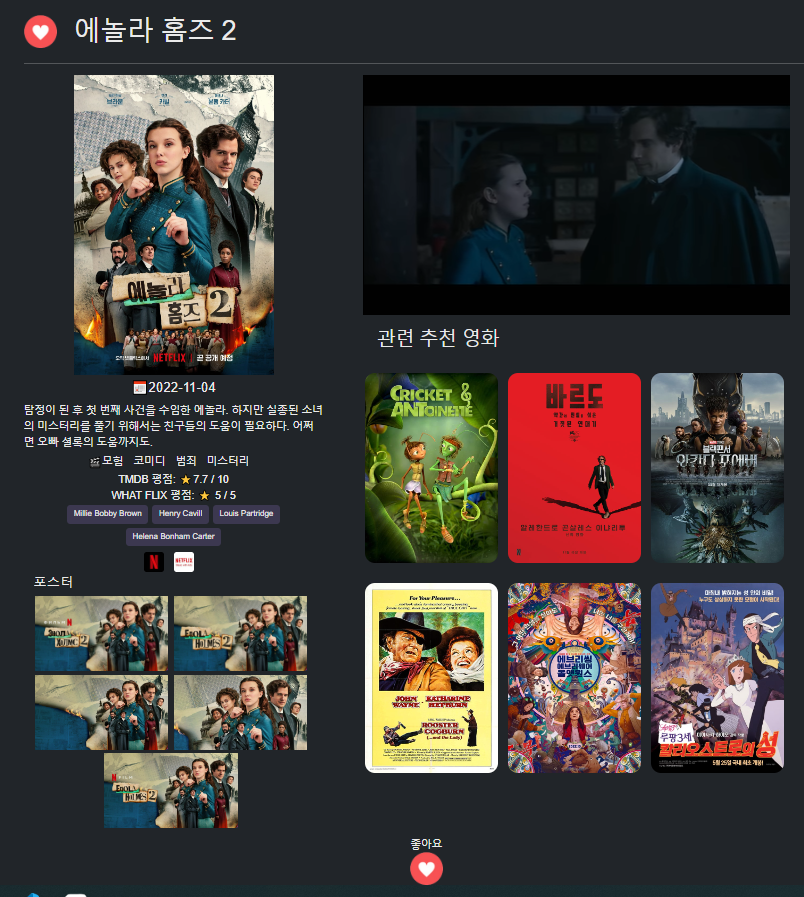

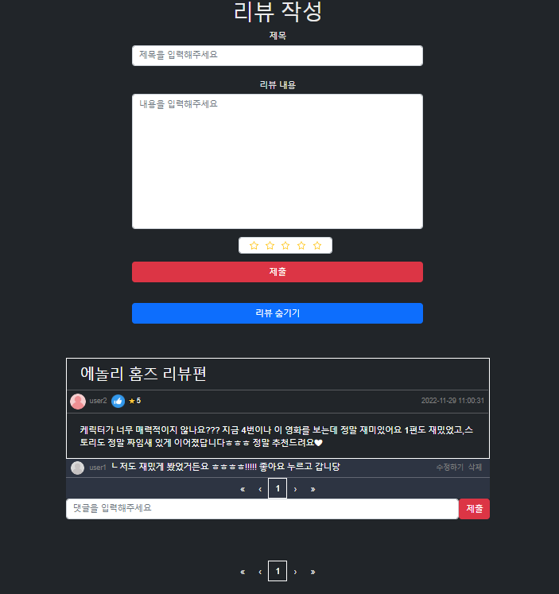

- 검색 기능
  - 단어를 입력할 때마다 즉각적으로 관련 영화가 찾아진다(반응형)
  - 배우/감독/영화 제목/줄거리에 대한 정보를 모두 필터해서 찾아주므로, 광범위한 검색 엔진을 가진다.

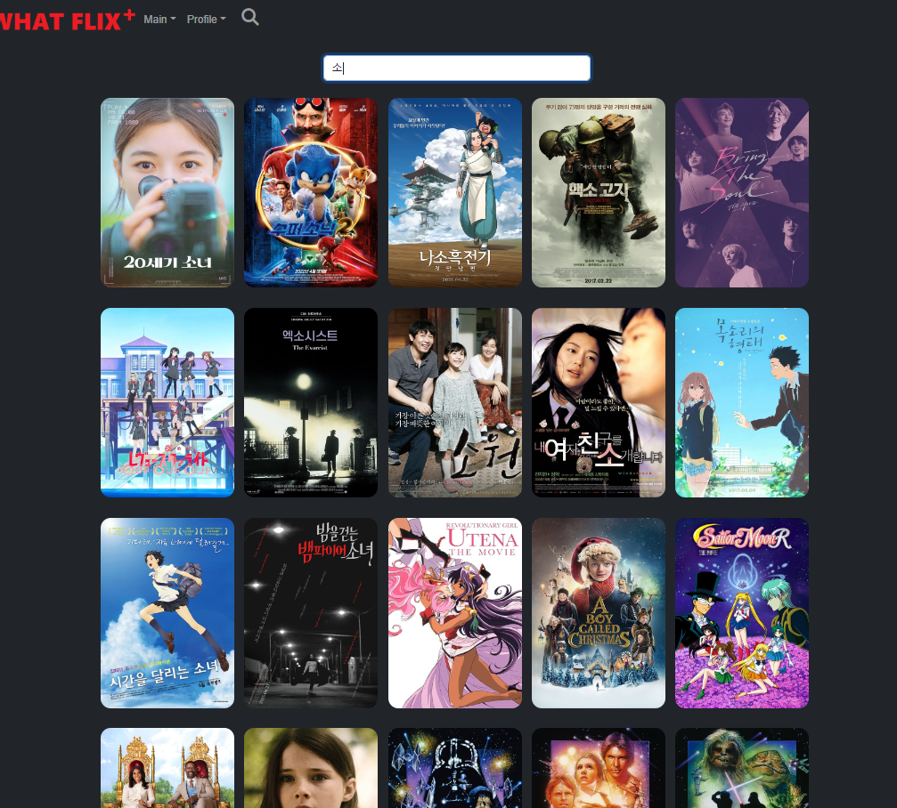

- 프로필

  - 해당 프로필 페이지를 가진 유저의 좋아요한 영화와 리뷰를 볼 수 있다.

  - 로그아웃, 개인정보 수정 기능도 같이 추가되어 있다.

  - 이미지의 생성/수정/삭제가 가능하다.

    - 기본 이미지도 총 4가지의 색상으로 구현되도록 만들었다

    - 이미지 최초 생성 시 유저 고유의 이미지가 생성되고, 수정/삭제 시 해당 이미지만 변경이 된다.

      -> DB 저장의 효율화

  - 팔로잉/팔로워 유저들도 모두 확인이 가능(클릭 시 해당 프로필로 이동)

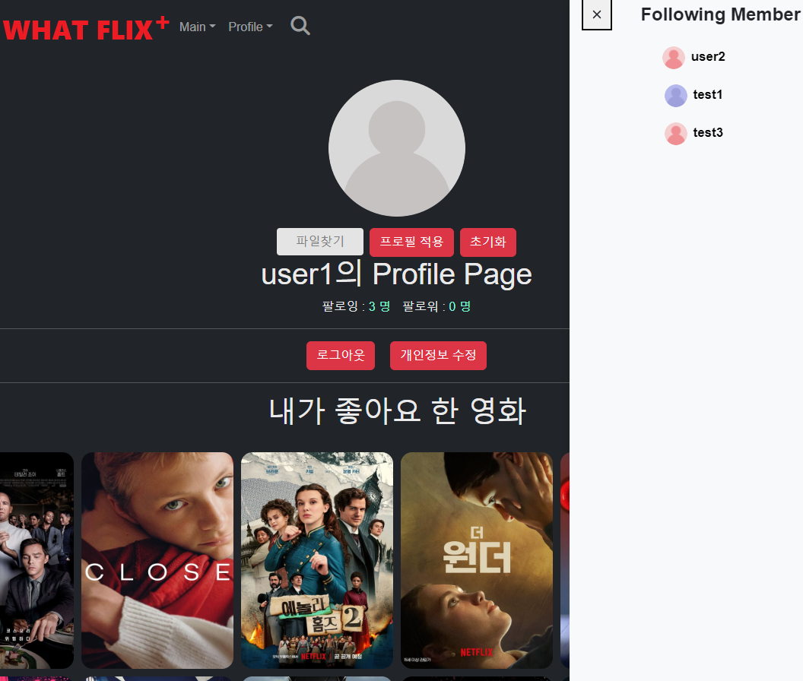

- 정보 변경
  - 비밀 번호 변경과 회원탈퇴 기능 가진다.

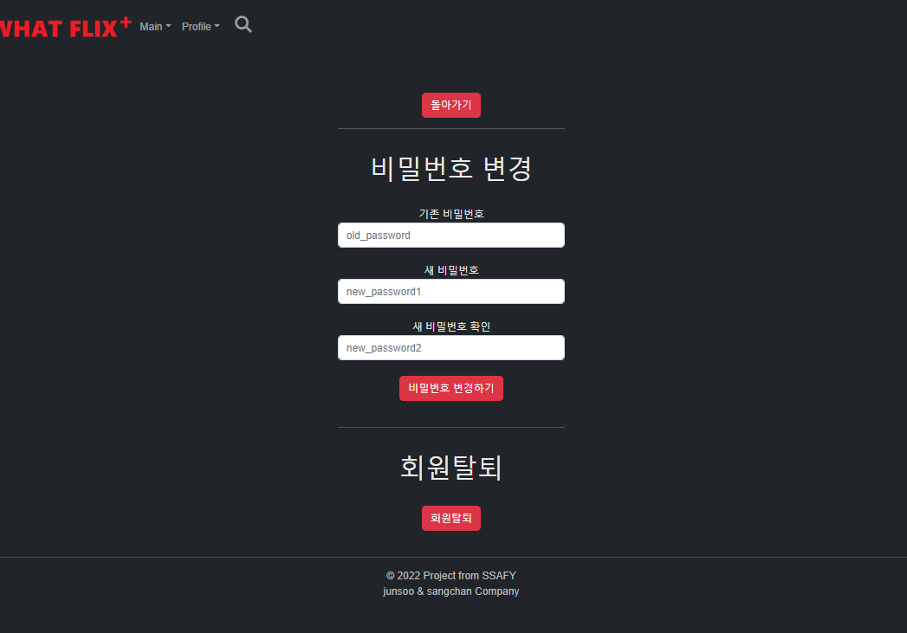

- 장르별 영화 조회
  - 장르별로 영화를 조회할 수 있는 기능을 갖추고 있다.

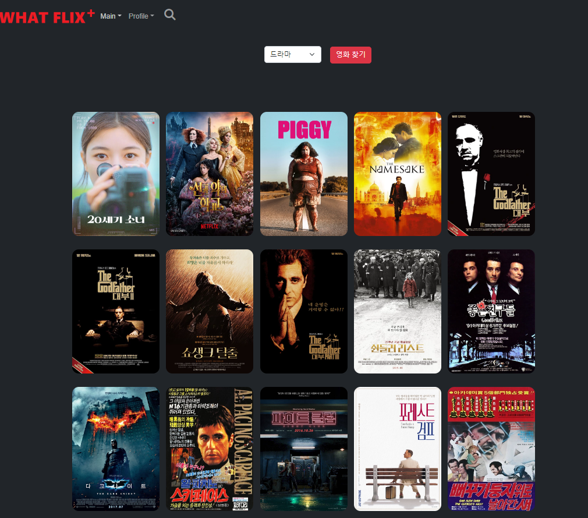

- 카카오맵(전국 영화관 위치 확인)
  - 공공데이터를 DB에 저장 후 각 지역구마다 영화관을 찾을 수 있게 구성
  - 마커를 통해 영화관의 위치를 확인할 수 있게 기능을 구현
  - 마우스 오버 시 어떤 영화관인지 정보를 알 수 있다

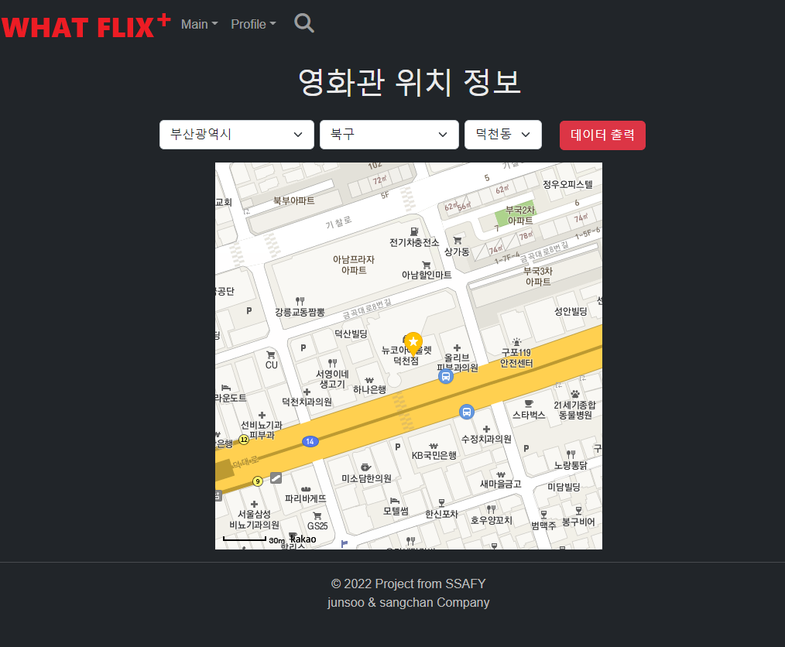

### 6. 기타 (느낀 점, 후기 등)

- 이상찬 후기

백엔드와 프론트 엔드를 모두 작업하였는데 각자의 매력을 가지고 있었던 것 같습니다. 특히 백엔드 영역에서 데이터를 조작, 가공, 수집하는 부분이 너무 재미있었고 관련 데이터로 알고리즘을 짜는 것도 정말 흥미로웠습니다. 우리가 원하는 알고리즘을 구현하기 위해 serializer와 django ORM에 대한 학습과 이해가 필요했고, 그 이전에는 데이터 원본에 대한 가공과 수집이 중요하다는 점도 확인할 수 있었습니다. 데이터베이스의 효율을 추구해서 필요한 정보만을 가져왔지만 작업을 진행하면서 추가 데이터가 필요하다는 것을 늦게 깨닫게 되었고 model을 재설정하는 경우도 존재했습니다. 그런 과정이 까다롭고 어려웠지만 하나의 경험으로 작용해 추후에는 조금더 원만하게 테이블 스키마를 설정하고 정보를 추출해야 겠다는 교훈을 깨닫게 되었습니다. 준수님과 협업을 하면서 불가능해보였던 기능들을 구현하고, 예상치 못한 버그를 고치는 등의 작업 또한 너무 재미있었습니다. 준수님 집에 3박을 머물면서 했던 프로젝트는 저에게 잊지 못할 추억이 될 것 같습니다. 2학기 프로젝트에서도 백엔드와 프론트 엔드를 균형있게 잡아서 진행해볼 자신감이 생겼습니다.