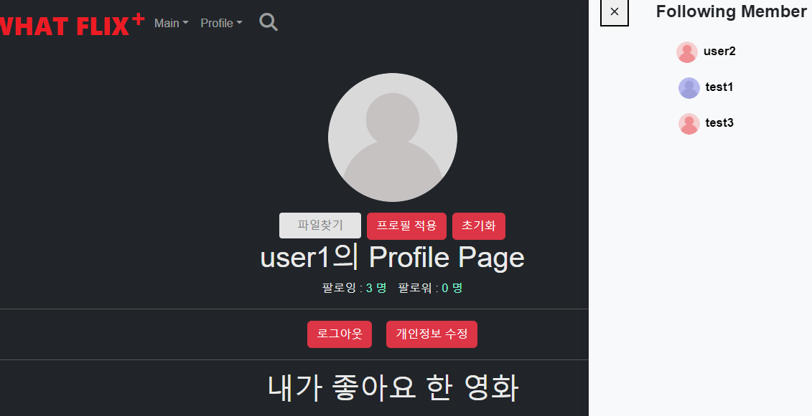

### 🛠11.27(영화 제공 스트리밍 사이트 추가)

- OTT사이트가 아닌 영화 추천 사이트이므로 스트리밍 제공사 공급이 필요
  - TMDB에 영화마다 스트리밍 정보를 제공
    - TMDB API를 활용해 해당 데이터 추가 저장 및 가공처리 진행(1대 N 관계)
    - 스트리밍 접속 사이트 링크도 추가로 제공


```python
# movies/views.py

@api_view(['GET'])
def movie_provieder(request, movie_id):
    '''
    스트리밍(넷플릭스, 왓챠 등)에 대한 정보를 불러오는 함수
    '''
    providers = get_list_or_404(Provider, movie_id = movie_id)
    serializer = ProviderSerializer(providers, many=True)
    return Response(serializer.data)

# movies/models.py
# 스트리밍(넷플릭스, 왓챠 등) 정보를 담는 테이블
class Provider(models.Model):
    movie = models.ForeignKey(Movie, on_delete=models.CASCADE)
    provider_link = models.CharField(max_length=200)
    provider_logo_path = models.CharField(max_length=200)
```


- 로고 이미지 출력 및 클릭 시 링크로 이동!


### 🛠11.29(프로필 이미지 생성, 수정, 삭제/팔로우, 팔로잉,댓글,리뷰, 프로필에 이미지 적용)

- 프로필 이미지가 있을 시 유저와의 소통과 친밀감이 높아짐
  - 꼭 구현하고 싶은 기능이었다
  - 이미지를 저장하기 위한 form.py 생성/ models설정/ views.py에서 저장 구현이 어려웠다.
  - 유저마다 고유의 프로필 이미지를 가지고 있고 중복 저장되지 않게 구현 진행!
    - 초기 이미지 생성 시 유저 아이디가 섞인 이미지 파일을 복사!
    - 해당 복사된 파일만 수정/삭제 되도록 진행
    - 삭제 시 default 이미지들 중에 하나로 랜덤 저장되도록 구현



```python
##### accounts/forms.py
# profile image 파일을 담기 위한 form
class UserForm(forms.ModelForm):
    
    class Meta:
        model = get_user_model()
        fields = ('profile_image',)

# accounts/models.py
# 팔로우, 프로필 이미지 기능을 위한 모델
class User(AbstractUser):
    followings = models.ManyToManyField('self', symmetrical=False, related_name='followers')
    profile_image = models.ImageField(blank=True, upload_to='images/')

###### accounts/views.py

@api_view(['GET', 'POST', 'DELETE'])
def profile_image(request, user_id):
    '''
    프로필 이미지를 저장하고 초기화하고 불러오는 함수
    
    [문제사항 1]: 이미지를 저장하면 기존 사진은 지워질 수 있게 구현하는 게 어려웠다. -> POST 요청을 했을 때에는 기존 데이터를 미리 삭제하고 저장하는 쪽으로 해결
     ※ django-cleanup을 활요하려고 하였으나, 기존 프로필을 지워버리는 현상이 발생
     
    [문제사항 2]: default 이미지를 다양한 색으로 표현하고 싶어서 따로 defaults 폴더 내에 기본 프로필 이미지를 색별로 4개 저장해주고 랜덤으로 제공하는 것으로 변경
    
    [문제사항 3]: 가장 초기의 이미지는 default 이미지를 복사해서 파일명에 유저명을 합쳐서 image 폴더 내에 저장(유저별 사진 구분 가능)
    '''
    User = get_user_model()
    me = request.user
    person = User.objects.get(id=user_id)
    if request.method == 'GET':
        if person.profile_image:
            serializer = UserSerializer(person)
        else:
            ran = random.sample(range(0, 4), 1)
            image = './media/defaults/default' + str(ran[0]) + '.png'
            shutil.copy(image, './media/images/default'+ str(ran[0]) + person.username + '.png')
            person.profile_image = 'images/default'+ str(ran[0]) + person.username + '.png'
            person.save()
            serializer = UserSerializer(person)
        return Response(serializer.data)
    elif request.method == 'POST':
        if me == person:
            person.profile_image.delete()
            form = UserForm(request.POST, request.FILES, instance=person)
            # print(form.is_valid())
            # print(request.FILES.get('image'))
            if form.is_valid():
                form = form.save(commit=False)
                form.profile_image=request.FILES.get('image')
                form.save()
                # print(form)
            serializer = UserSerializer(person)
            return Response(serializer.data)
    elif request.method == 'DELETE':
        person.profile_image.delete()
        ran = random.sample(range(0, 4), 1)
        image = './media/defaults/default' + str(ran[0]) + '.png'
        # shutil.copy(image, './media/images/default'+ str(ran[0]) + '.png')
        # person.profile_image = 'images/default'+ str(ran[0]) + '.png'
        shutil.copy(image, './media/images/default'+ str(ran[0]) + person.username + '.png')
        person.profile_image = 'images/default'+ str(ran[0]) + person.username + '.png'
        person.save()
        serializer = UserSerializer(person)
        return Response(serializer.data)
```


- 미디어 파일에 기본 프로필을 색깔별로 추가 저장
  - 동적인 느낌이 보이도록 구현
  - 랜덤으로 색깔이 입혀지게 함
  - 각 유저의 이미지가 생성/수정/삭제 시 하나의 이미지만 저장되도록 구현(DB 저장 효율화!)


```vue
//ProfileView.vue

getProfileImage() {
        axios({
        method: 'post',
            url: `${API_URL}/accounts/wantid/`,
            data: {
            username: this.userName
            },
            headers: { 
              Authorization: `Token ${this.$store.state.token}`
            },
      })
      .then((res) => {
        const id = res.data.userid
        axios({
        method: 'get',
        url: `${API_URL}/accounts/profile_image/${id}/`,
        data: this.image,
        headers: { 
          'Content-Type': 'multipart/form-data',
              Authorization: `Token ${this.$store.state.token}`
            },
        })
        .then((res) => {
          this.profileImageUrl=`${API_URL}${res.data.profile_image}`
        })
        .catch((err) => {
          console.log(err)
        })
        })
      .catch((err) => {
        console.log(err)
      })
    },
    SaveImage() {
      if (!this.image) {
        swal("파일 없음!", "파일을 업로드 해주세요!", "warning");
      } else {
        axios({
        method: 'post',
            url: `${API_URL}/accounts/wantid/`,
            data: {
            username: this.userName
            },
            headers: { 
              Authorization: `Token ${this.$store.state.token}`
            },
      })
      .then((res) => {
        const id = res.data.userid
        axios({
        method: 'post',
        url: `${API_URL}/accounts/profile_image/${id}/`,
        data: this.image,
        headers: { 
          'Content-Type': 'multipart/form-data',
              Authorization: `Token ${this.$store.state.token}`
            },
        })
        .then((res) => {
          this.profileImageUrl=`${API_URL}${res.data.profile_image}`
          swal("업로드 완료!", "프로필 편집이 완료되었습니다", "success");
        })
        .catch((err) => {
          console.log(err)
        })
        })
      .catch((err) => {
        console.log(err)
      })
      }
```


### 🛠12.01(전국 영화관 위치 카카오맵 구현!)

- 한국문화정보원의 국내 영화관 위치 데이터를 엑셀파일로 받아와서 DB에 저장
  - csv파일을 DB에 저장하는 방법을 학습!


```python
#movies/views.py

def csv_to_DB(request):
'''
example.csv이라는 영화관 공공데이터를 통해 csv를 DB에 저장하는 함수
[문제사항]: 위도와 경도는 문자로 저장되기 때문에 추후에 숫자로 바꿔야한다.
'''
     data = pandas.read_csv("./movies/example.csv")
     filter_data = data.filter(items=['POI_NM', 'CTPRVN_NM','SIGNGU_NM', 'LEGALDONG_NM', 'LC_LO', 'LC_LA'])
     total_cnt = len(filter_data)
     for i in range(total_cnt):
         Cinema.objects.create(
             name = filter_data.loc[i][0],
             metropolitan_city = filter_data.loc[i][1],
             district = filter_data.loc[i][2],
             region = filter_data.loc[i][3],
             latitude = filter_data.loc[i][4],
             altitude = filter_data.loc[i][5]
             )
```


- 시, 구, 동 별로 데이터를 불러와서 해당 영화관 위치를 불러오는 함수 작성
  - 시 선택 시 해당 시와 관련된 구가 불러와지고, 구가 선택되면 관련된 동이 불러와지도록 설정
  - 구체적인 위치를 설정할 수 있게 하여 소비자가 원하는 지역을 확인할 수 있도록 구현


```python
#movies/views.py

@api_view(['GET'])
def cinema_list(request):
    '''
    주어진 3가지의 주소 데이터(광역시, 구, 동)를 통해 해당 영화관 찾아서 반환하는 함수
    [아이디어]: 카카오 맵을 표현할 때 지역 단위로 구분하고 싶었다.
    '''
    metropolitan_city = request.GET.get('metropolitan_city')
    district = request.GET.get('district')
    region = request.GET.get('region')
    cinema = Cinema.objects.filter(metropolitan_city=metropolitan_city).filter(district=district).filter(region=region)
    if len(cinema) == 1:
        serializer = CinemaSerializer(cinema[0])
        return Response(serializer.data)
    elif len(cinema) >= 2:
        serializer = CinemaSerializer(cinema, many=True)
        return Response(serializer.data)


@api_view(['GET'])
def district_list(request, city):
    '''
    city를 선택하고 나서 데이터를 받은 후에 district의 옵션을 결정해주기 위한 함수
    예를 들어, 강원도가 선택되어지면 그에 따른 구들이 옵션에 나타나도록 할 예정
    '''
    cinemas = Cinema.objects.filter(metropolitan_city=city)
    selectcity = cinemas.order_by('district')
    results = selectcity.values_list('district', flat=True).distinct()
    return Response(results)


@api_view(['GET'])
def region_list(request, city, district):
    '''
    광역시와 구의 정보를 바탕으로 도를 파악하는 함수
    [문제상황] 광역시의 필터를 걸어주지 않으니 다른 광역시와 같은 구가 겹쳐서 나오는 경우가 생겼었다
    '''
    cinemas = Cinema.objects.filter(metropolitan_city=city).filter(district=district)
    selectcity = cinemas.order_by('region')
    results = selectcity.values_list('region', flat=True).distinct()
    return Response(results)
```


- 카카오맵 API 활용
  - 카카오맵 API 사이트에 자세하게 사용방법이 명시됨
  - Vue에 적합한 형태로 함수 변형
  - 마커로 위치가 찍힐 수 있게 추가 구현 진행
- 어려웠던 점
  - JavaScript 문법이 익숙치 않아서 힘든 사항이 많았음(추가 학습 필요!)

```vue
initMap() {
      const Lng = Number(this.Lng);
      const Lat = Number(this.Lat);
      const container = document.getElementById("map");
      const options = {
        center: new kakao.maps.LatLng(Lat, Lng),
        level: 3,
      };
      this.map = new kakao.maps.Map(container, options);
      // console.log(this.map)

      // 현재 표시되어 있는 marker 제거
      if (this.markers.length > 0) {
        this.markers.forEach((item) => {
          item.setMap(null);
        });
      }

      // 마커 이미지 불러오기
      const imageSrc =
        "https://t1.daumcdn.net/localimg/localimages/07/mapapidoc/markerStar.png";
      const imageSize = new kakao.maps.Size(24, 35);
      // 마커 이미지를 생성합니다
      const markerImage = new kakao.maps.MarkerImage(imageSrc, imageSize);
      this.markerPositions.forEach((position) => {
        const marker = new kakao.maps.Marker({
          map: this.map,
          position: position.latlng,
          // title: position.title,
          image: markerImage,
        });
        // 마커에 표시할 인포윈도우를 생성합니다
        const infowindow = new kakao.maps.InfoWindow({
          content: `<span style="color: black;">${position.title}</span>`, // 인포윈도우에 표시할 내용
        });
        // 마커에 mouseover 이벤트와 mouseout 이벤트를 등록합니다
        // 이벤트 리스너로는 클로저를 만들어 등록합니다
        // for문에서 클로저를 만들어 주지 않으면 마지막 마커에만 이벤트가 등록됩니다
        kakao.maps.event.addListener(
          marker,
          "mouseover",
          this.makeOverListener(this.map, marker, infowindow)
        );
        kakao.maps.event.addListener(
          marker,
          "mouseout",
          this.makeOutListener(infowindow)
        );
        this.markers.push(marker);
      });

      //마커가 2개 이상일 때 모두 보일 수 있게 지도 이동
      const bounds = this.markerPositions.reduce(
        (bounds, position) => bounds.extend(position.latlng),
        new kakao.maps.LatLngBounds()
      );
      this.map.setBounds(bounds);
    },
    // 인포윈도우를 표시하는 클로저를 만드는 함수입니다
    makeOverListener(map, marker, infowindow) {
      return function () {
        infowindow.open(map, marker);
      };
    },
    // 인포윈도우를 닫는 클로저를 만드는 함수입니다
    makeOutListener(infowindow) {
      return function () {
        infowindow.close();
      };
    },
```


### 🛠12.03(검색 엔진 최적화 + 텍스트 에디터 추가 실패)

- 💥**문제점** **발견**
  - @input을 활용할 경우 유저의 입력마다 axios가 호출되어 데이터가 중복되어 표시됨
    - 예를 들어 brad pitt 배우를 입력하였지만, b/br/brad 각각의 데이터가 나중에 처리되어 화면에 표시되어 버림
  - 로딩 스피너가 없어서 화면이 반응하고 있는지 알 수 없음!

- 🛠**최적화** **진행**
  - setTime함수를 통해 입력 후 **2.5초** 뒤에 axios 요청이 진행되도록 함<span style="color:red;">**(delay가 핵심!!)**</span>
    - 단, axios 요청 시 입력된 값과 현재 검색입력에 들어간 값이 동일할 경우만 axios 요청을 보냄
    - 현재 검색어가 요청 입력과 다른 경우에는 바로 return하게 진행하여 호출되지 않도록 함
  - 뒤늦게 응답된 데이터가 현재 데이터를 덮어씌이는 경우!!!(중복 업데이트 제거!)
    - 뒤늦게 응답된 데이터의 검색어 입력값이 현재의 입력값과 일치할 경우에만 덮어쓰기 인정
    - 현재의 검색어가 응답되어온 검색어와 다를 경우 덮어쓰지 않고 그냥 return
  - 로딩 스피너 추가
    - axios 전 isLoading을 true로 하여 로딩바가 돌도록 하였으며 응답 후에 false로 로딩바를 제거


```vue
methods: {
    SearchData(e) {
      //뭔가를 걸어준다.시간 지연 -> 최적화 필요//
      //동작이 매끄럽지 않고 버그가 생길 수 있음//
      
      const inputData = e.target.value
      this.currentData = e.target.value

      //입력이 없을 경우 로딩 버튼이 생기지 않게 설정//
      if (inputData.length === 0) {
        this.isLoading = false
        this.searchMovies = []
      } else {
        // 입력 후 2500ms의 간격을 주고 검색을 진행//
        // 현재 입력값과 찾을 입력값이 다르면 진행 하지 않는다(고객이 계속 입력 중이라는 의미) //
        setTimeout(() => {
          if (inputData === this.currentData) {
            this.isLoading = true
            axios({
              method: 'get',
              url: `${API_URL}/api/v1/movies/search/${inputData}/`
          })
          .then((res) => {
            // 이전에 요청한 데이터가 뒤늦게 화면에 출력될 경우가 있음//
            // 예전의 입력값이 현재의 입력값과 같으면 화면에 출력하고, 그렇지 않으면 바로 return할 수 있게 하면서 뒤늦게 출력되는 것을 방지//
            if (inputData === this.currentData) {
              this.searchMovies = res.data
              this.isLoading = false
            } else {
              return
            }
          })
          .catch(() => {
              this.searchMovies = []
          })
          } else {
            return
          }
        }, 2500)
      }
      }}
```

- 텍스트 에디터 기능 추가 실패
  - 텍스트 에디터 기능을 추가하였지만, 해당 값이 출력될 때 `<p> <strong>`과 같은 문법들이 문자열로 표시됨
  - 추후 시간될 때 확인이 필요함!!
